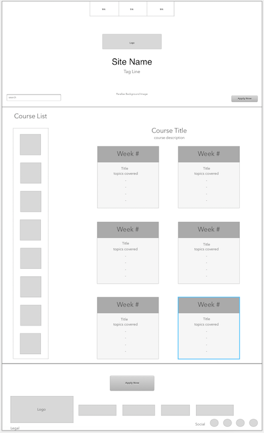
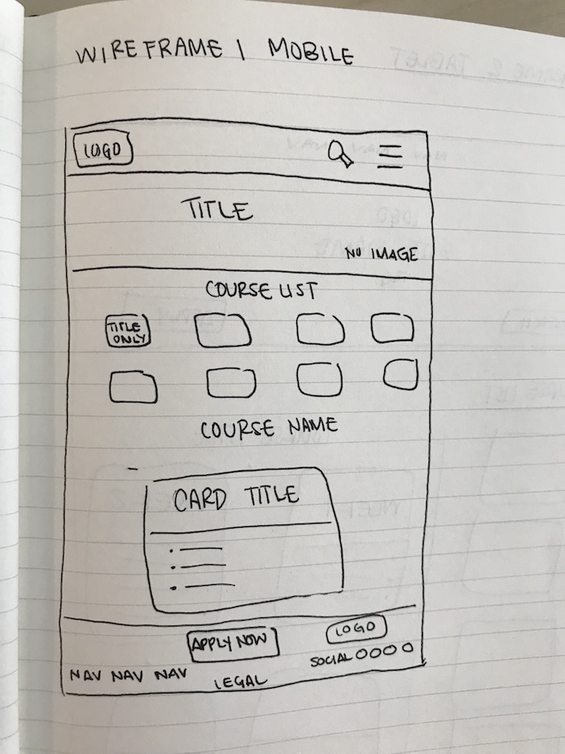

# _Site Redesign:Learn How To Program_

#### _A single page application that redesigns the Learn How to Program site, November 17, 2017_

#### _By **Colin Worf & Ginger Lee Kretschmer**_

## Description

_This is a redesign for the Epicodus Learn How to Program landing page using SASS._

## Setup/Installation Requirements

* _Please copy this link into the browser of your choice. https://gingerlee.github.io/learn-how-to-program

## Support and contact details

_Questions? Contact Colin at colin.worf@gmail.com Ginger at kretschmons@gmail.com_

## Technologies Used

_HTML, SASS and CSS_

## Wireframes
We created four different versions of this site using Sketch for wireframes. See each design below:

### Wireframe 1

* **Wireframe 1 Desktop** 
* **Wireframe 1 Tablet** 
* **Wireframe 1 Mobile** 

### Wireframe 2

* **Wireframe 2 Desktop** 
* **Wireframe 2 Tablet** 
* **Wireframe 2 Mobile**  

## SASS Elements Used

| SASS Element   |      Description      |  Use in Application |
|----------|-------------|------|
|

### License

Copyright (c) 2017 **_Colin Worf & Ginger Lee Kretschmer_**
