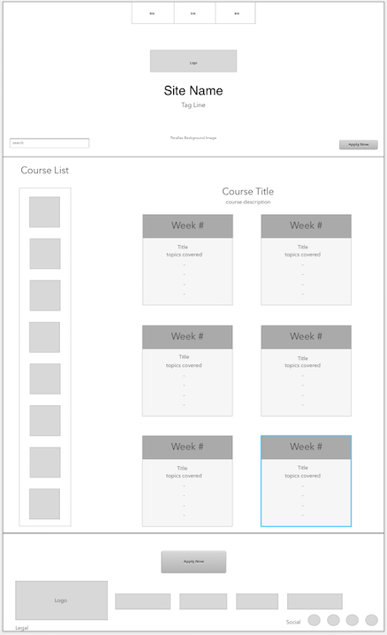
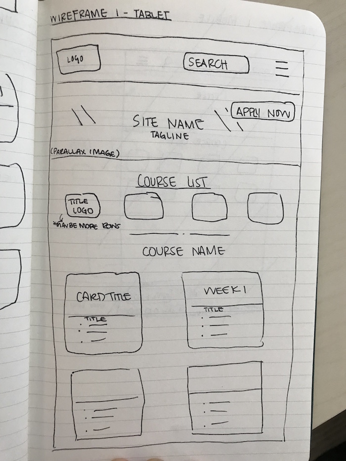
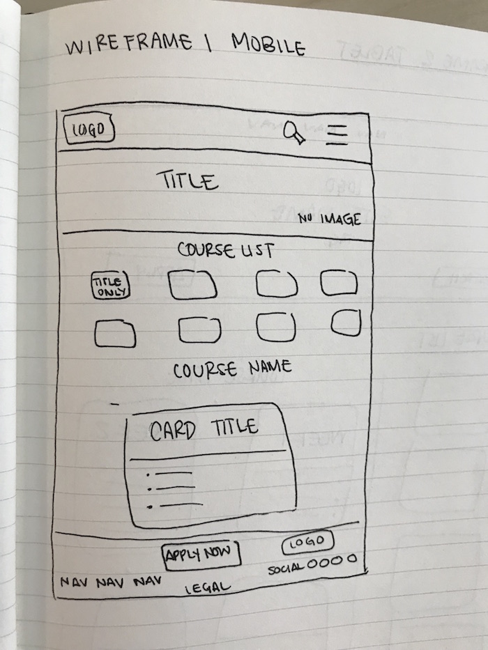
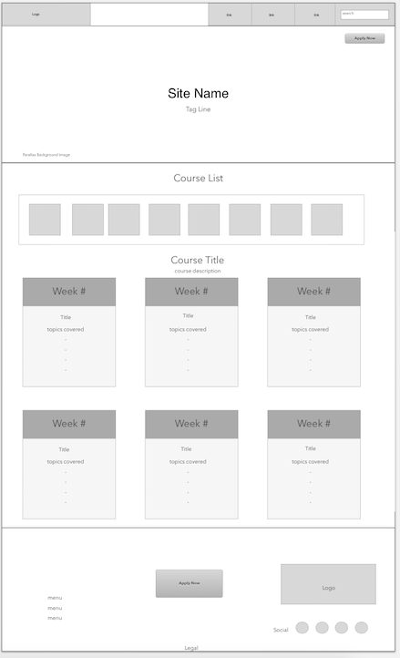
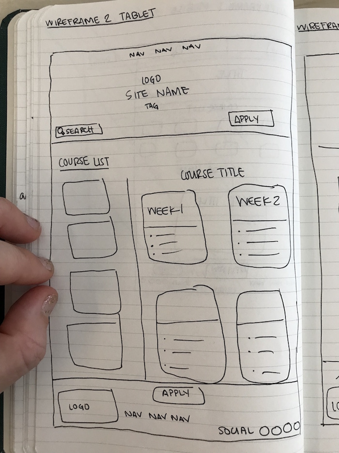

# _Planning for SASS 2-day Project_

#### _By **Colin Worf & Ginger Lee Kretschmer**_

## Description

_This is a redesign for the Epicodus Learn How to Program landing page using SASS._

## SASS Elements Used

| SASS Element   |      Description      |  Use in Application |
|----------|-------------|------|
|Mixins | 
## Wireframes
We created four different versions of this site using Sketch for wireframes. See each design below:

### Wireframe 1

* **Wireframe 1 Desktop** 
* **Wireframe 1 Tablet** 
* **Wireframe 1 Mobile** 

### Wireframe 2

* **Wireframe 2 Desktop** 
* **Wireframe 2 Tablet** 
* **Wireframe 2 Mobile** 

### License

Copyright (c) 2017 **_Colin Worf & Ginger Lee Kretschmer_**
